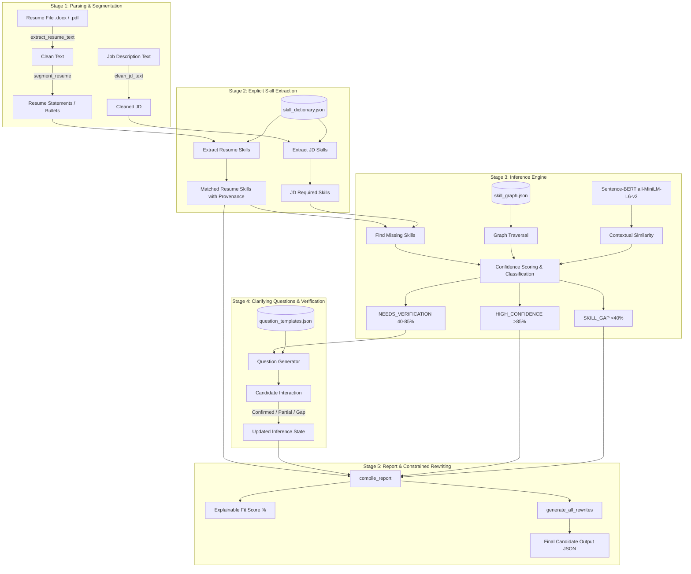

# SkillGraph — NLP Pipeline for Inferring Implicit Skills in Resumes

[](https://www.python.org/downloads/)
[](https://spacy.io/)
[](https://www.sbert.net/)
[](https://networkx.org/)

**SkillGraph** is an explainable NLP pipeline designed to solve a critical limitation of traditional resume parsers: **candidates rarely list every skill they possess, yet traditional keyword screeners penalize them for implicit knowledge.**

Instead of ungrounded generative LLM guesses, SkillGraph combines:
1. **Curated Skill Gazetteer & NER** for explicit detection.
2. **Graph-based domain relationships** (NetworkX) combined with **Semantic Similarity** (Sentence-BERT, local & offline) to infer implicit skills.
3. **Interactive verification** using deterministic clarifying questions.
4. **Constrained, academically honest resume rewriting** to naturally incorporate confirmed skills without hallucination.

---

## 📌 5-Stage Architecture Overview



---

## 🔬 Core Pipeline Stages

### Stage 1: Parsing & Segmentation (`skillgraph/parser.py`)
- Extracts raw text from `.docx` or `.pdf` using `python-docx` and `pdfplumber`.
- Cleans extraction artifacts (PDF multi-column broken sentences, non-standard linebreaks).
- Segments text into discrete bullet-level accomplishment statements while stripping decorative separators and section headings.
- Cleans and normalizes job description text.

### Stage 2: Explicit Skill Extraction (`skillgraph/extractor.py`)
- Loads a gazetteer (`skillgraph/skill_dictionary.json`) covering canonical names and known synonyms/aliases.
- Performs greedy, longest-match-first phrase matching with word-boundary awareness (e.g., preventing `"go"` from matching `"django"`).
- Cross-references spaCy NER entities (`ORG`, `PRODUCT`, `GPE`).
- Preserves **statement-level provenance**: every extracted skill is directly linked to the specific bullet statement it came from.

### Stage 3: Inference Engine (`skillgraph/inference.py`)
Identifies which required skills are missing from the resume, but are implied by the candidate's existing experience.
- Traverses a hand-curated directed relationship graph (`skillgraph/skill_graph.json`) via NetworkX.
- Measures semantic similarity between the candidate's actual bullet point statement and the missing skill name using **Sentence-BERT** (`all-MiniLM-L6-v2`, running completely local/offline).
- Computes an explainable confidence score:
  $$\text{confidence} = \left( w_{\text{graph}} \cdot \text{edge\_weight} + w_{\text{semantic}} \cdot \text{cosine\_similarity} \right) \times 100$$
  *(Defaults: $w_{\text{graph}} = 0.5$, $w_{\text{semantic}} = 0.5$)*
- Categorizes inferences into:
  - `HIGH_CONFIDENCE` (> 85%): Accepted without asking.
  - `NEEDS_VERIFICATION` (40% – 85%): Triggers clarifying questions in Stage 4.
  - `SKILL_GAP` (< 40% or no graph predecessor): Genuine gap.

### Stage 4: Clarifying Question Generation & Verification (`skillgraph/verifier.py`)
- Focuses strictly on `NEEDS_VERIFICATION` inferences.
- Uses pre-authored templates (`skillgraph/question_templates.json`) rather than ungrounded generative LLMs.
- Maps candidate choices deterministically:
  - *"Implemented it myself"* / *"Hands-on"* $\rightarrow$ `CONFIRMED`
  - *"Used a library/tool"* / *"Part of a framework"* $\rightarrow$ `PARTIALLY_CONFIRMED`
  - *"Not sure"* $\rightarrow$ `SKILL_GAP`
- Flags verified items with `verified: true`.

### Stage 5: Report Generation & Resume Rewrite Suggestions (`skillgraph/reporter.py`)
- Compiles the final candidate-facing fit report with an explainable score:
  $$\text{fit\_percentage} = \frac{\text{matched\_score}}{\text{total\_required\_skills}} \times 100$$
- **Constrained Resume Bullet Rewriting**: Produces honest, slot-filled sentence rewrites incorporating verified skills into the original statements.
  - Guarantees **academic honesty**: Never invents metrics, tools, or experiences beyond what was verified.
  - Transparently denotes partial exposure (*"framework/tooling exposure"*).

---

## 📂 Project Structure

```
├── skillgraph/
│   ├── __init__.py
│   ├── parser.py                 # Stage 1: Parsing & Segmentation
│   ├── extractor.py              # Stage 2: Explicit Extraction
│   ├── skill_dictionary.json     # Curated tech skill gazetteer (~55 skills, ~200 variants)
│   ├── inference.py              # Stage 3: Graph Traversal & SBERT Scoring
│   ├── skill_graph.json          # Directed relationship graph (64 weighted edges)
│   ├── verifier.py               # Stage 4: Question Generation & Verification
│   ├── question_templates.json   # Deterministic question templates
│   └── reporter.py               # Stage 5: Report Compilation & Constrained Rewrites
├── samples/
│   └── sample_resume.docx        # Generated test resume
├── test_stage1.py                # Test script for Stage 1
├── test_stage2.py                # Test script for Stage 2
├── test_stage3.py                # Test script for Stage 3
├── test_stage4.py                # Test script for Stage 4
├── test_stage5.py                # Full end-to-end test (Stages 1 through 5)
├── requirements.txt              # Project dependencies
└── README.md                     # Project documentation
```

---

## 🚀 Getting Started

### 1. Prerequisites
- Python 3.10+ (tested on Python 3.10 - 3.14)
- Virtual environment recommended

### 2. Installation

```bash
# Clone the repository
git clone https://github.com/Ashwin-R05/Skillgraph---NLP.git
cd Skillgraph---NLP

# Create and activate virtual environment
python3 -m venv .venv
source .venv/bin/activate

# Install dependencies
pip install -r requirements.txt
```

> **Note on PyTorch / Sentence-Transformers:**
> For CPU-only environments, install PyTorch with:
> ```bash
> pip install torch --index-url https://download.pytorch.org/whl/cpu
> pip install sentence-transformers networkx
> ```

### 3. Running Stage Tests

Each stage has an independent test script demonstrating its inputs, processing, and output:

```bash
# Run Stage 1 (Parsing & Segmentation)
python test_stage1.py

# Run Stage 2 (Explicit Skill Extraction)
python test_stage2.py

# Run Stage 3 (Inference Engine)
python test_stage3.py

# Run Stage 4 (Question Generation & Verification)
python test_stage4.py

# Run Full End-to-End Pipeline (Stages 1 through 5)
python test_stage5.py
```

---

## 📊 Sample Pipeline Output (Stage 5)

```json
{
  "fit_summary": {
    "total_required_skills": 16,
    "matched_count": 13,
    "fit_percentage": 81
  },
  "skills_breakdown": {
    "explicitly_present": [
      "AWS", "Apache Kafka", "Apache Spark", "Django", "Docker",
      "FastAPI", "Kubernetes", "Microservices", "PostgreSQL", "Python", "Redis"
    ],
    "confirmed_by_inference": [
      {
        "missing_skill": "Distributed Systems",
        "matched_resume_skill": "Microservices",
        "matched_statement": "Designed and implemented a microservices architecture using Python/FastAPI and PostgreSQL, reducing API latency by 35%.",
        "confidence": 53,
        "classification": "CONFIRMED",
        "verified": true,
        "selected_option": "Implemented it myself"
      }
    ],
    "partially_confirmed": [
      {
        "missing_skill": "ETL",
        "matched_resume_skill": "Apache Spark",
        "confidence": 47,
        "classification": "PARTIALLY_CONFIRMED",
        "verified": true,
        "selected_option": "Used a library/tool"
      }
    ],
    "high_confidence_unverified": [],
    "genuine_gaps": [
      { "missing_skill": "GCP", "classification": "SKILL_GAP", "confidence": 28 },
      { "missing_skill": "MySQL", "classification": "SKILL_GAP", "confidence": 40 },
      { "missing_skill": "RabbitMQ", "classification": "SKILL_GAP", "confidence": 34 }
    ]
  },
  "suggested_rewrites": [
    {
      "missing_skill": "Distributed Systems",
      "original_statement": "Designed and implemented a microservices architecture using Python/FastAPI and PostgreSQL, reducing API latency by 35%.",
      "suggested_rewrite": "Architected distributed microservices systems using Python/FastAPI and PostgreSQL, reducing API latency by 35%."
    },
    {
      "missing_skill": "ETL",
      "original_statement": "Python, JavaScript, TypeScript, SQL, FastAPI, Django, React, Docker, Kubernetes, Kafka, Spark, PostgreSQL, Redis, Git",
      "suggested_rewrite": "Python, JavaScript, TypeScript, SQL, FastAPI, Django, React, Docker, Kubernetes, Kafka, Spark, PostgreSQL, Redis, Git, ETL (framework/tooling exposure)."
    }
  ]
}
```

---

## 🛡️ Academic & Design Principles

1. **Deterministic & Explainable**:
   - Every inference references a specific source bullet from the resume (`matched_statement`).
   - Confidence scoring is computed via a transparent, documented algebraic formula combining graph priors with sentence embeddings.
2. **Zero Hallucination Guarantee**:
   - Rewrites do not use open-ended LLM text generation. They use constrained slot-filling that reflects only what was verified by the candidate.
3. **Offline & Privacy-Preserving**:
   - All models (`en_core_web_sm` and `all-MiniLM-L6-v2`) run locally. No candidate data or resume content is transmitted to third-party APIs.
